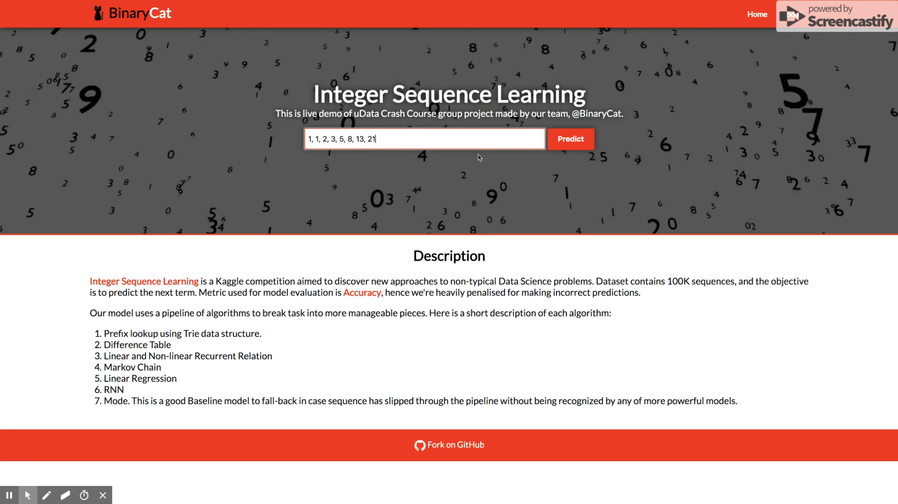

# Integer Sequence Learning
This is a repository of project developed by @BinaryCat team during uData Crash Course.

## Kaggle [competition](https://www.kaggle.com/c/integer-sequence-learning/): 1, 2, 3, 4, 5, 7?!
The goal of this project was to develop stand-alone system that combines several approaches to process a given sequence in order to predict the next term. Dataset was collected from [OEIS Encyclopedia](https://oeis.org/) and tampered a bit, with noise added and some terms randomly removed. Accuracy is used for evaluation, thus penalising heavily for not exact prediction. Best accuracy achieved by the combined effort of our team and Kaggle contributors is 25.25%, which would have placed us on 15th position of public leaderboard.

## [Live demo](int-seq.herokuapp.com)

We've created a micro-service using Flask back-end and hosted it on Heroku platform. Since we're using free Dyno, site uptime is 200h. per month.

## Reproduce

Run `reproduce.ipynb` and follow the instructions.

## Acknowledgments

- Our core model is a courtesy of [Balzac's Kernel](https://www.kaggle.com/balzac/prefixes-lookup-0-22).
- The idea of reformatting problem as multi-class labeling that made Recurrent Network applicable was developed on the basis of [this repo](https://github.com/Kyubyong/integer_sequence_learning).
- The idea of ensemble of models is discussed [here](https://www.kaggle.com/c/integer-sequence-learning/discussion/24971) in great detail.
